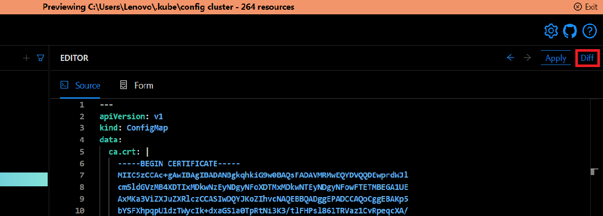

# How to Browse Clusters

Monokle is a fully integrated IDE for managing manifests. It provides instant access for debugging Kubernetes resources without looking into the yaml syntax. 

In this tutorial, we have illustrated the steps to help you browse and debug the resources generated with kustomize and Helm. 

Let’s get started. 

**Step 1:** Launch Monokle and click on the Cluster Preview button in the file explorer.

<em>**Note:** Please follow this Getting Started guide to install Monokle 🚀</em>

**Step 2:** Click on the Browse button to fetch the kubeconfig file for configuring cluster access. 

 

Alternatively, you can also enter the kubeconfig file path manually in the KUBECONFIG text field. 

 

<em>**Note:** The kubectl command-line tool uses kubeconfig files to find the information it needs to choose a cluster and communicate with the API server.</em>

**Step 3:** Click on the Show Cluster Objects button to launch the resources in the configured cluster. 

 

Monokle will switch to the Cluster-Mode, and the Navigator will reflect all the resources retrieved from the configured cluster. 

**Step 4:** Select a resource to view its source code in the source editor (in read-only mode). 

 

**Step 5:** Click on the Apply button to assign the resource to the currently configured cluster.

Resource applied will be shown in the top-right corner of the console. 

**Step 6:** Click the Diff button to analyze and compare the selected resource against the currently configured cluster. 

 

The comparison table will look like this:

 

**Step 7:** Click on the Exit button on the top-right corner of the console to restore the resources of the currently selected folder. 

 

Thus you can browse cluster resources. 

If you still have doubts, feel free to connect with us. Monokle is your K8s best friend!
