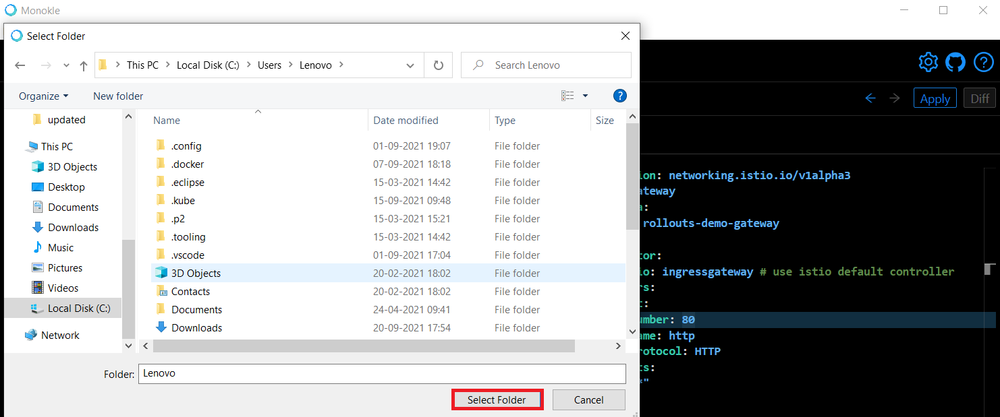

# How to Create New Resources

Monokle is a fully integrated IDE for managing manifests. It provides instant access for debugging Kubernetes resources
without looking into the YAML syntax.

In this tutorial, we have illustrated steps to create new resources for including new features in your project.

Let’s get started.

**Step 1:** Launch Monokle and click on the Browse button to add your project folder containing K8 resources.

<em>**Note:** Please follow this [Getting Started](../getting-started.md) guide to install Monokle 🚀</em>

**Step 2:** Select your folder to parse its manifest in Monokle’s file explorer.

In the file explorer, you can view manifests, including their resources, and their relationships.

**Step 3:** Click on the Add button in the Navigator to launch the form for adding a new resource.

**Step 4:** Enter the name of the new resource in the name field.

**Step 5:** Select the kind of resource from the dropdown menu.

**Step 6:** Enter the API version in the field to manage resources.

**Step 7:** Select Namespace from the dropdown menu.

**Step 8:** Click on the dropdown to select an existing resource as a template.

**Step 9:** Click on the OK button to save the new resource configuration.

Thus you can create new resources.

Got queries? Please feel free to join our open source community on Discord with this invite link and start your
discussion.
